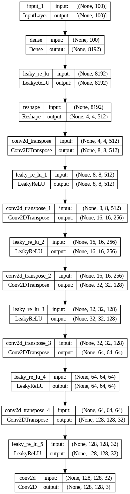
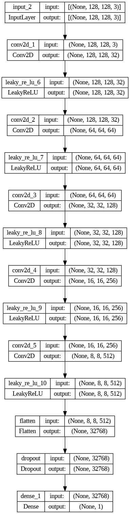
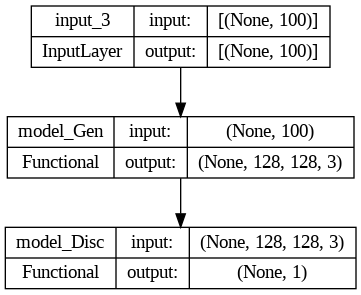

# DCGAN_Keras
Tensorflow (Keras) implementation of Deep Convolutional Generative Adversarial Networks. 

## Approach
This is an implementation of DCGAN on [CelebA](https://mmlab.ie.cuhk.edu.hk/projects/CelebA.html) dataset. I have sampled 10,000 images from the whole dataset and trained the model for 10,000 iterations. 

## Model
Model architecture for Generator, Discriminator, and GAN:

### Generator

### Discriminator

### GAN

## Results

